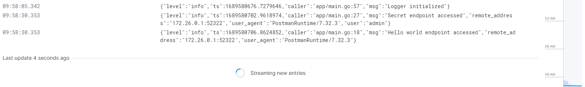

# ELK Stack 
This is an example project that sets up an ELK Stack.  
Comes with an very simple **Gin-REST-API** with Basic Auth, written in Go.  
I'm using ***Uber's Zap Logger***, the sugared variant.  
The App is written that it uses debug Logging for the console and Production logging for the log-files.  
I would disable the console logging when running this in Prod.  

## What is that

The ELK Stack consists of these components:  

- **Elasticsearch**: Distributed search engine that stores and indexes the logs.

- **Logstash**: Data processing pipeline that ingests data from multiple sources, processes it, and sends it to Elasticsearch for indexing.

- **Kibana**: Data visualization and exploration tool that allows you to interact with your logs stored in Elasticsearch.

- **Filebeat**: Lightweight log shipper that reads log files and forwards them to Logstash or Elasticsearch.

## How to run
Use the ```docker-compose.yaml``` file I provided.  
```
docker-compose up -d
```
This will automatically build the image from the Dockerfile and sets up networking, volumes etc.  
Be aware of the setting files of logstash and filebeat.  

### Container Networking
The docker-compose file creates a default network, that lets the containers in the stack talk to each other via the service name.  

### Kibana
Visit the WebUI on ```localhost:5601``` and go to Observability > Streams. If there is no data you have to maybe change the log indeces under Settings.  

